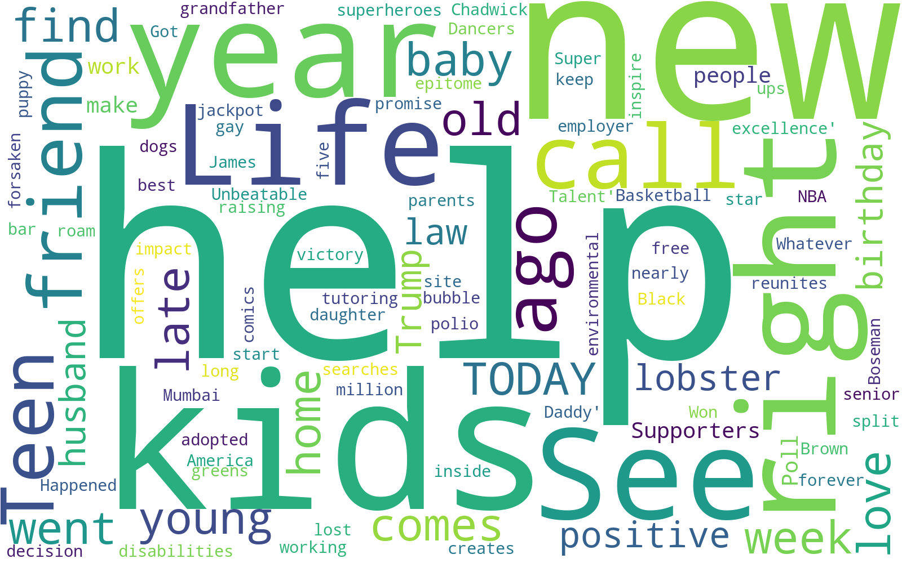
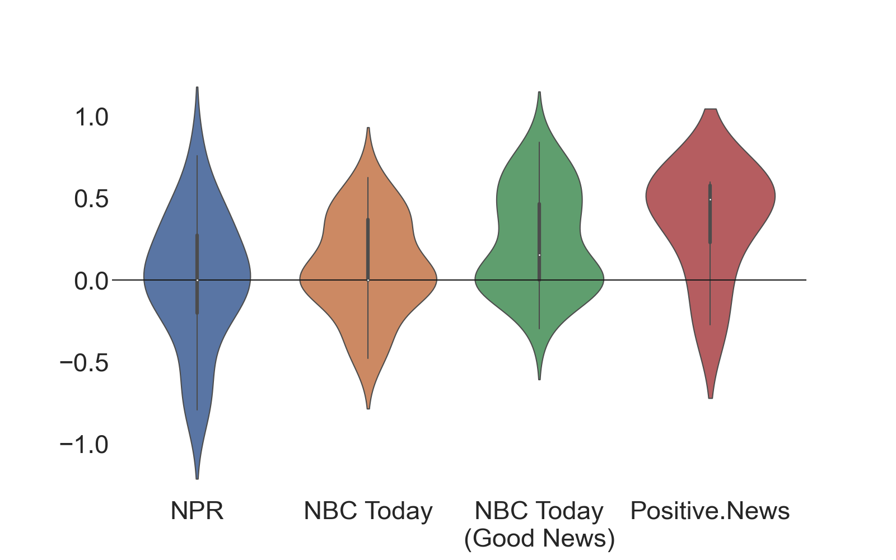

# print('positive')
This project was developed as part of an intensive eight-week data science fellowship at The Data Incubator. The goal of the project was to create an aggregator for positive news.

### Problem Statement/Purpose
Consuming negative news on a daily basis can have a significant impact on our mental health. In response, news organizations are starting to recognize the benefits serving positive content to users, but they are not the only ones. Other companies like Starbucks, Apple, and Coca-Cola know that positive emotions toward a brand have greatly influence consumer loyalty and can lead to greater sales. The purpose of this project was to develop a tool that can be used by companies to highlight positive stories to help improve mental health and drive sales.

Compare sentiment of various news organizations.

### Data/Models Used
The data used in this project comes from four sources--two neutral sources and two sources that specialize in providing positive and uplifting news stories.

Neutral Sources:
- [NPR](https://www.npr.org/)
- [NBC Today](https://www.today.com/)

Positive Sources:
- [NBC Today - Good News](https://www.today.com/news/good-news)
- [Positive News](https://www.positive.news/)

Headlines are scraped from the front page of each news organization using BeautifulSoup and then passed through the Valence Aware Dictionary and sEntiment Reasoner (VADER) sentiment analysis tool available in the Natural Language ToolKit (NLTK) package to generate a normalized score between +1 (positive sentiment) and -1 (negative sentiment).

These scores are used to sort the data and identify the top 10 positive stories, which are then served to the user in a Flask web application. Data for the web application is generated each time the page is reloaded to keep the content up-to-date.

### Results
In addition to providing links to positive news articles, the web application also generates a word cloud to visualize words associated with positive, neutral, and negative headlines as well as a violin plot to visualize differences in sentiment from different news sources.

*Example of most common words in positive news articles*

*Example of comparison between news sources*

The results show that certain words are correlated with positive sentiment. Words like "help", "kids", and "friend" appear more frequently in positive articles and may reflect a desire to stay connected to family and friends.

The results also show that the VADER sentiment analysis tool distinguishes between positive and negative articles fairly well. The median scores for each of the neutral news sources was near 0 while both positive news sources had a median score above 0.

NPR headlines showed the greatest range in sentiment while Positive.News demonstrated a much greater skew towards positive headlines, even compared to the other positive news source. This is not entirely surprising considering Positive.News considers themselves "the first media organization in the world that is dedicated to quality, independent reporting about what's going right."

One of the advantages of using VADER for sentiment analysis is that it does not require any training data; however, this can also be a disadvantage for unique use cases like this project. For example, while testing the web application, the VADER sentiment analysis tool generated a positive score for a story from NPR about [a university having to move classes online because several students tested positive for the coronavirus](https://www.npr.org/sections/coronavirus-live-updates/2020/08/16/903071127/less-than-a-week-after-starting-classes-unc-chapel-hill-reports-4-covid-19-clust). Likewise, a story about [Americans becoming increasingly polarized over racial justice](https://www.npr.org/2020/09/03/908878610/americans-increasingly-polarized-when-it-comes-to-racial-justice-protests-poll-f) received the same score as a story about [therapy dog offering comfort to California firefighters](https://www.today.com/pets/kerith-golden-retriever-offers-comfort-firefighters-t190150). While these kinds of misclassifications were generally rare, a more advanced sentiment analysis model specifically trained on news headlines may offer classification improvements.

The next stage of this project will seek to improve the algorithm used to classify news headlines as positive or negative.
